Table of Contents

1.  Installations

2.  Project Motivation

3.  File Descriptions

4.  Results

5.  Licensing, Authors, Acknowledgements

Installation

The code should run with no issues using Python 3. The following libraries are
used in the code:

\* sys

\* pandas

\* sqlalchemy

\* nltk

\* json

\* numpy

\* re

\* pickle

\* sklearn

Project Motivation

In this project, I would like to apply the skills that I learned from Udacity
Data Scientist course to analyze disaster data from Figure Eight to build a
model for an API that classifies disaster messages into different categories.

File Descriptions

Here is the structure of the project:

\- app

>   o templates

>   \* go.html \# classification result page of web app

>   \* master.html \# main page of web app

\- data

>   o disaster_categories.csv \# category data to process

>   o disaster_messages.csv \# message data to process

>   o process_data.py \# Python code to process the data

>   o DisasterResponse.db \# database that has cleaned data

\- img \# This directory includes all the origianl image files I captured

\- Media  \# This directory includes all the image files used in README

\- Models

>   o train_classifier.py \# Python code to build the model

>   o Classifier.pkl \# saved model

\- README.md

The project has three parts:

1.  The first part is the Extract, Transform and Load (ETL) pipeline
    process_data.py file. It loads the message and category datasets, merges
    them based upon the same ID, clean the merged dataset, then store the clean
    data into an SQLite DB – DisasterResponse.db.

2.  The second part is to build a Machine Learning pipeline –
    train_classifier.py. It loads the clean data from DisasterResponse.db, split
    the data into a training set and a test set, it then creates a machine
    learning pipeline that uses NLTK, scikit-learn’s pipeline, and GridSearchCV
    to output a final model that uses the message column to predict
    classifications for 36 categories (multi-output classification). Finally, it
    exports the model to a pickle file – Classifier.pkl.

3.  The third part is a Flask web app. The web app has two parts:

    1.  Classify a message: a user enters a message, the page displays its
        classification.

    2.  Three visualizations on the training dataset:

        1.  Distribution of message genres

        2.  Message categories distribution

        3.  Top 10 categories

Results

To see the results, please run the following commands in sequence:

1.  Go to “data” subdirectory, and type:

    python process_data disaster_messages.csv disaster_categories.csv
    DisasterResponse.db

>   Here is the screen snapshot to show that the program runs successfully with
>   no error message, the cleaned data is now saved to DisasterResponse.db.

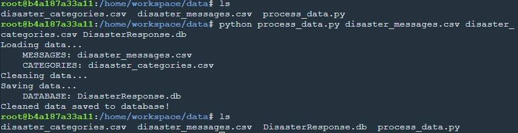

1.  Go to “models” subdirectory, and type:

>   python train_classifier.py ../data/DisasterResponse.db Classifier.pkl

>   Here are the few screen snapshots to show that the program runs successfully
>   with no error message, it prints out the classification report for each
>   category, and the accuracy of the model. Finally, the model is saved to a
>   pickle file – Classifier.pkl.

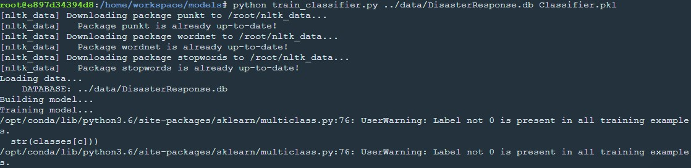

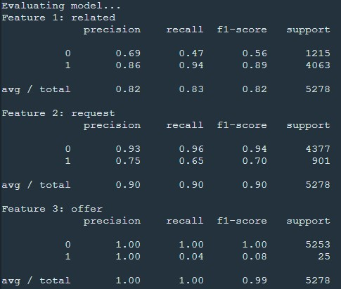

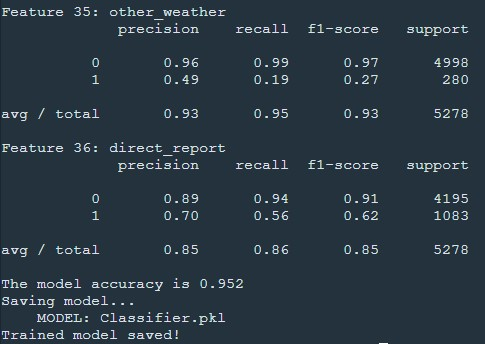

1.  Go to “app” subdirectory, and type:

    Python run.py

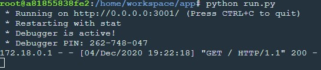

Open another Terminal Window, and type:

env \| grep WORK

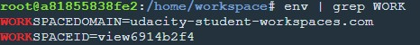

Now, in a new web browser window, type in the following URL:

<https://view6914b2f4-3001.udacity-student-workspaces.com>

The web page should show up:

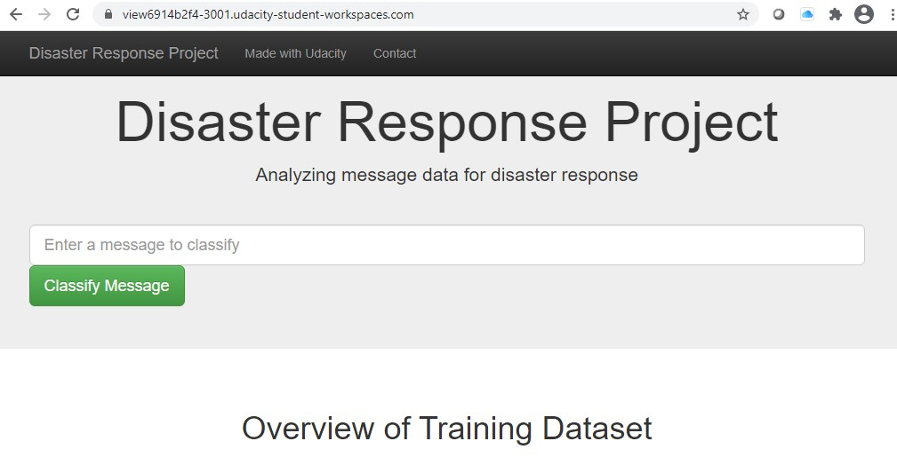

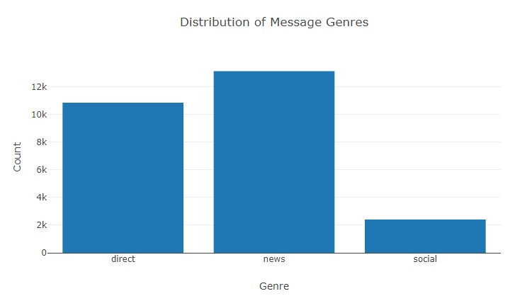

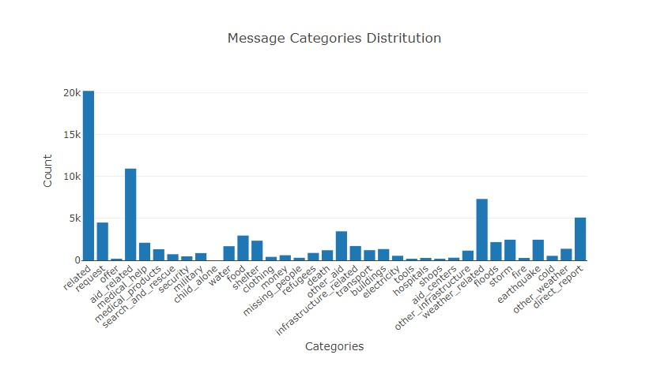

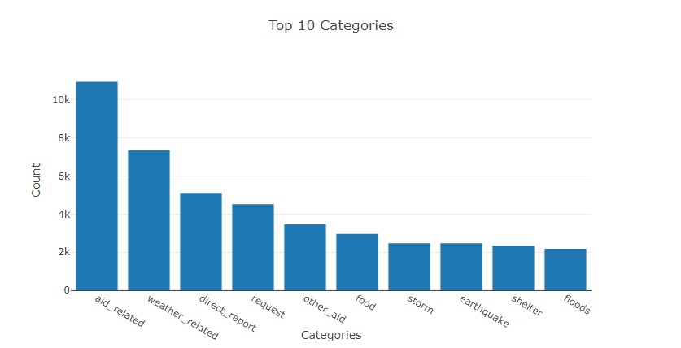

Type “we need more food” in the message box, click on “Classify Message” button,
then the page will be updated to show the result:

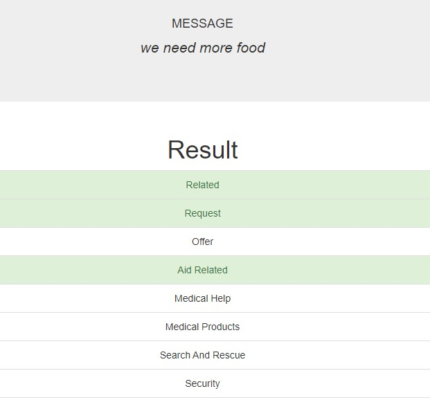

Licensing, Authors, Acknowledgements

Thanks Udacity for providing the skeleton files and data sets. Thanks Sanjeev
Yadav for his post which provides me ideas on where and how I should improve my
work on this project.
